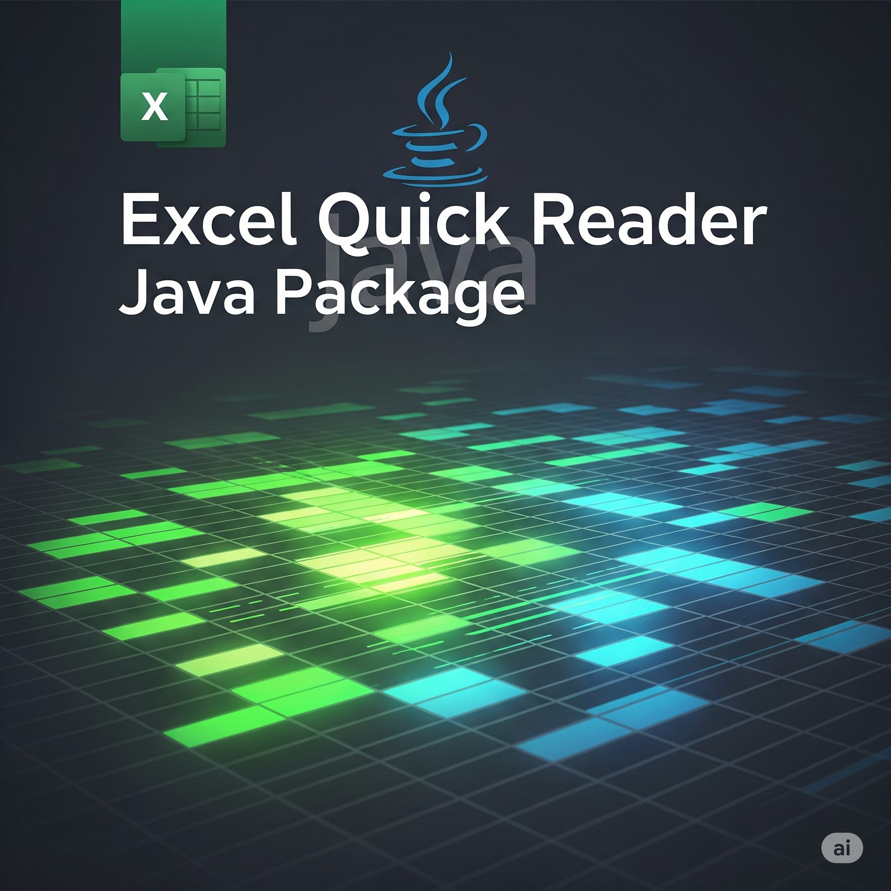

Have been thinking for quite some time to write this utility. I wrote similar utilities like this to parse excel file quickly on every projects I worked on last few years.

I don't know how useful it will be on this AI era, may be just for myself :-)




## **Overall Arch**
Intentionally we published this package as standalone library, so that can be used with any Java/J2EE framework. This library published to maven central so you can easily integrate with any build tools i.e. Maven or Gradle of your choice. 

- Input

    - Json defination file
    - Excel Data file

- Output    

    - Get Map of key , value pair in the same structure provided in defination file. So that you use BeanUtils like package to copy data from Map to custom DTOs.

---

## **Getting Started**

To get started, you’ll need a working Java project. If you want to work with SpringBoot project checkout [Spring Initializr](https://start.spring.io/). There is sample SpringBoot application in sample folder of the [github project](https://github.com/nemo97/QuickExcelReader), please refer README file.

- Add the following to your `pom.xml` file to use the 

Quick Excel Reader library in your Java project. Checkout for latest version in [Maven Central](https://repo.maven.apache.org/maven2/io/github/nemo97/QuickExcelReader/) or [mvnrepository.com](https://mvnrepository.com/artifact/io.github.nemo97/QuickExcelReader)

```xml
<dependency>
    <groupId>com.github.nemo97</groupId>
    <artifactId>quick-excel-reader</artifactId>
    <version>1.0-RC</version>
</dependency>

```

- You need to add the following dependencies to your `pom.xml` file for JSON and Excel parsing, if already not present.
```xml
<dependency>
    <groupId>com.fasterxml.jackson.core</groupId>
    <artifactId>jackson-databind</artifactId>
    <version>2.15.2</version>
</dependency>   
<dependency>
    <groupId>org.apache.poi</groupId>
    <artifactId>poi-ooxml</artifactId>
    <version>5.2.3</version>
</dependency>

```

- Create Excel defination file in resources for maven project. Refer schema defination section for details.

```json

{
  "schemaVersion": "1.0",
  "sheets": [
    {
      "sheetName": "def1", /* excel sheet name, sheet can be any order. Code with match the name before read corresponding sheet   */
      "description": "This is a sample definition file for def1.",
      "fields": [
        {
          "name": "field1", /* Field name, this will key name result map. So make it unique */
          "xlsColumn": "A3", /* Excel column to map. Mandatory on first field. When not provided, it wil assume next cell of same row*/
          "type": "string", /* Type string */
          "validation": { /* for future use */
            "required": true,
            "maxLength": 50,
            "regex": "^[a-zA-Z0-9_]+$"
          },
          "description": "This is a string field."
        },
        {
          "name": "field2",
          "type": "long", /* type is long. when no xlsColumn filed provided, it will assume next cell of same row. For this defination this field will map to B3 */
          "validation": {
            "required": true,
            "range": {
              "min": 1,
              "max": 100
            }
          },
          "description": "This is an integer field."
        },
        {
          "name": "field21",
          "type": "double", /* double type to read as floating point number, map to C3 */
          "validation": {
            "required": true,
            "range": {
              "min": 1,
              "max": 100
            }
          },
          "description": "This is an decimal field."
        },
        {
          "name": "field3",
          "type": "boolean", /* boolean type */
          "validation": {
            "required": true
          },
          "description": "This is a boolean field."
        },
        {
          "name": "field4", 
          "type": "table", /* this is special type to read table of data */
          "xlsColumn": "B8-B9", /* xlsColumn range for table, if this is missing has to provide in fields level(both inclusive).For complex type of table when columns have been merged , you have to provide in fields lebel.*/
          "fields": [
            {
              "name": "field4a",
              "type": "long",
              "validation": {
                "required": true
              },
              "description": "This is a long field."
            },
            {
              "name": "field4b",
              "type": "string",
              "validation": {
                "required": true,
                "maxLength": 100
              },
              "description": "This is a string field."
            },
            {
              "name": "field4c",
              "type": "string",
              "validation": {
                "required": true,
                "maxLength": 100
              },
              "description": "This is a string field."
            }
          ]
        }
      ]
    }
  ]
}
```

You can use the `src\test\QuickExcelReaderTest` test class as a reference. 
```java
// Copy Excel and JSON files from classpath to temp files
InputStream excelStream = getClass().getResourceAsStream("/simple_excel.xlsx");

Path excelFile = Files.createTempFile("test", ".xlsx");
        Files.copy(excelStream, excelFile, java.nio.file.StandardCopyOption.REPLACE_EXISTING);

InputStream jsonStream = getClass().getResourceAsStream("/def1.json");
Path jsonFile = Files.createTempFile("test", ".json");
        Files.copy(jsonStream, jsonFile, java.nio.file.StandardCopyOption.REPLACE_EXISTING);


QuickExcelReader reader = QuickExcelReader.builder()
        .excelPath(excelFile)
        .jsonPath(jsonFile)
        .build();

ResultExcelData result = reader.read();

// print the result as map
System.out.println("Result: " + result.getDataMap());

```


## Excel Definition Schema

Here is a concise Markdown documentation for the JSON schema in `src/main/resources/config_schema.json`:


### Overview
This schema defines the structure for configuring Excel sheet definitions, including sheets, fields, and validation rules.

### Root Object

| Property        | Type    | Description                | Required |
|-----------------|---------|----------------------------|----------|
| schemaVersion   | string  | Version of the schema      | Yes      |
| sheets          | array   | List of sheet definitions  | Yes      |

---

### Sheet Object

| Property     | Type    | Description                | Required |
|--------------|---------|----------------------------|----------|
| sheetName    | string  | Name of the sheet          | Yes      |
| sheetIndex   | integer | Index of the sheet         | No       |
| description  | string  | Description of the sheet   | No       |
| fields       | array   | List of field definitions  | Yes      |

---

### Field Object

| Property     | Type    | Description                                                                 | Required |
|--------------|---------|-----------------------------------------------------------------------------|----------|
| name         | string  | Field name                                                                  | Yes      |
| xlsColumn    | string  | Excel column name                                                           | No       |
| type         | string  | Data type: `string`, `double`, `long`, `boolean`, `table`                   | Yes      |
| validation   | object  | Validation rules (see below)                                                | No       |
| description  | string  | Field description                                                           | No       |
| fields       | array   | Nested fields (for type `table`)                                            | No       |

---

### Validation Object

| Property   | Type    | Description                        | Required |
|------------|---------|------------------------------------|----------|
| required   | boolean | Whether the field is required      | No       |
| maxLength  | integer | Maximum length (for strings)       | No       |
| regex      | string  | Regular expression pattern         | No       |
| range      | object  | Numeric range (see below)          | No       |

### Range Object

| Property | Type   | Description         | Required |
|----------|--------|---------------------|----------|
| min      | number | Minimum value       | Yes      |
| max      | number | Maximum value       | Yes      |

---

### Example

```json
{
  "schemaVersion": "1.0",
  "sheets": [
    {
      "sheetName": "Users",
      "fields": [
        {
          "name": "username",
          "type": "string",
          "validation": {
            "required": true,
            "maxLength": 20
          }
        }
      ]
    }
  ]
}
```

---

## Notes

- Fields of type `table` can contain nested `fields`.
- All required properties must be present in the configuration.

---

